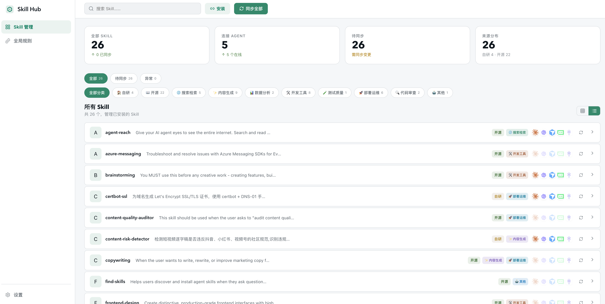

<p align="center">
  <picture>
    <source media="(prefers-color-scheme: dark)" srcset="screenshots/dashboard.png">
    
  </picture>
</p>

<h1 align="center">Skills Hub</h1>

<p align="center">
  <strong>A local dashboard to manage AI coding agent skills across multiple agents.</strong>
  <br />
  One place to view, sync, install, and organize skills for all your AI coding agents.
</p>

<p align="center">
  <a href="README.zh.md">中文版</a>
  •
  <a href="https://skills-hub.dev">🌐 Website</a>
</p>

<p align="center">
  <a href="https://github.com/liuxingqitd/skills-hub/releases">
    
  </a>
  <a href="LICENSE">
    
  </a>
  <a href="https://github.com/liuxingqitd/skills-hub/stargazers">
    
  </a>
  <a href="https://github.com/liuxingqitd/skills-hub/issues">
    
  </a>
  
  
</p>

---

## ❤️ Sponsor

| Sponsor | |
|---|---|
| <a href="https://ofox.ai"><strong>Ofox AI</strong></a> | Thanks to [Ofox AI](https://ofox.ai) for sponsoring this project! Sign up via the link and get a $3 bonus on your first top-up. Ofox AI provides reliable LLM API aggregation — one API for 100+ models including OpenAI, Claude, Gemini, DeepSeek, Qwen, Kimi, and more. |

---

## What It Does

Skills Hub scans the skills installed by your local AI coding agents and presents everything in a unified dashboard.

- **Unified Dashboard** — Card grid or list view showing every skill's installation status per agent
- **One-Click Sync** — Missing or outdated skills? Sync them across all agents with one click
- **Install New Skills** — Support GitHub repos, SSH URLs, or local paths. Auto-detects `SKILL.md`
- **Global Rules Editor** — Edit each agent's instruction/rule files from one UI with live preview
- **Categories & Tags** — Auto-categorization + manual tagging to keep your skill library organized

### How It Works

Skills Hub has **no database, no cloud storage**. It directly reads your local agent directories, compares source and target `SKILL.md` content via SHA-256, and determines sync status:

| Status | Meaning |
|:---:|---|
| **Synced** | Target matches source |
| **Missing** | Skill not installed on this agent |
| **Drifted** | Installed but content differs from source |
| **Collision** | Path blocked by an existing file |
| **Orphaned** | Installed but source skill was deleted |

Sync resolves these: missing/drifted → copy fix, collisions → skip, orphans → optionally clean up.

## Website

Visit **[skills-hub.dev](https://skills-hub.dev)** — the official product website featuring showcases, documentation, and more.

## Quick Start

### Users: Install the Desktop App

Download the latest release from the [Releases page](https://github.com/liuxingqitd/skills-hub/releases).

- **macOS Intel** → `.dmg` with `x86_64` in filename
- **macOS Apple Silicon** → `.dmg` with `aarch64` / `arm64` in filename
- **Windows** → `.exe` or `.msi`

Open the app and it will scan your local agent directories automatically.

> ⚠️ Builds are unsigned. macOS may show a security warning. If you see "Skills Hub is damaged and can't be opened", run:
> ```bash
> xattr -dr com.apple.quarantine "/Applications/Skills Hub.app"
> ```

### Maintainers: Build Release Packages

Push a `v*` tag to trigger GitHub Actions to build macOS / Windows installers:

```bash
git tag v0.1.0
git push origin v0.1.0
```

### Developers: Local Setup

```bash
npm install
npm run dev
# → http://localhost:3000
```

| Command | Description |
|---|---|
| `npm run build` | Web production build |
| `npm start` | Start production web server |
| `npm run desktop:build` | Build desktop installer |
| `npm test` | Run tests |
| `npx tsc --noEmit` | TypeScript type-check |

## Tech Stack

**Next.js 15** + **React 19** + **TypeScript** + **Tailwind CSS v4** + **Tauri 2**. Desktop client reads the local filesystem directly — zero external dependencies.

## Screenshots

<p align="center">
  
  <br />
  <em>Dashboard — see all skills and their sync status at a glance</em>
</p>

## Supported Agents

Skills Hub is agent-agnostic — configure any agent by editing `config/agents.json`. Out of the box it supports:

- OpenClaw
- Cursor
- Claude Code
- Windsurf
- [Add yours →](CONTRIBUTING.md)

## Roadmap

- [x] Desktop client (Tauri)
- [x] Multi-agent sync
- [x] Global rules editor
- [ ] Community skill store / marketplace
- [ ] Skill performance analytics
- [ ] One-click publish skills to GitHub
- [ ] Plugin API for custom agent integrations

## Contributing

Contributions are welcome! See [CONTRIBUTING.md](CONTRIBUTING.md) to get started.

## License

[MIT](LICENSE)
